# Trabajo práctico 9

Este trabajo práctico construye sobre los dos trabajos prácticos anteriores. 

* El directorio `contracts` debe contener los contratos `CFPFactory.sol` y `CFP.sol`, que serán versiones modificadas de los producidos para el práctico 7. Las nuevas especificaciones se encuentran en el archivo [README.md](contracts/README.md) de ese directorio.
* El directorio `api` contiene la implementación de una API REST que interactúa con los contratos, y además trabaja con una base de datos local para almacenar información fuera de la cadena (*off chain*). Las nuevas especificaciones se encuentran en el archivo [README.md](api/README.md) de ese directorio.

## Nuevos conceptos

### Almacenamiento *off chain*

Hasta este práctico, toda la información relevante del sistema vivía exclusivamente en el contrato: quién había presentado una propuesta, cuándo, con qué identificador. Esta arquitectura es atractiva porque los datos en la cadena son inmutables, públicamente verificables y no dependen de ningún servidor externo. Sin embargo, tiene un costo muy concreto: almacenar datos en Ethereum es caro.

El costo de almacenamiento en Ethereum se paga en *gas*. Cada byte que se escribe en el estado del contrato tiene un costo fijo en gas, y ese gas se traduce en Ether. Almacenar un string de 100 caracteres puede costar varios dólares; almacenar documentos, imágenes o incluso descripciones largas resulta prohibitivo. Además, la cadena no está diseñada como un sistema de almacenamiento de propósito general: su fortaleza es garantizar la ejecución correcta de código y la integridad de los datos, no el acceso eficiente a grandes volúmenes de información.

La solución adoptada en este práctico es una arquitectura híbrida: se almacena *on chain* únicamente el hash de los datos relevantes, y los datos en sí se guardan *off chain*, en una base de datos convencional administrada por el servidor de la API. El contrato no sabe nada sobre el título ni la descripción de una propuesta; solo conoce su identificador (la raíz de un árbol de Merkle). Quien quiera verificar que una propuesta no fue alterada puede recalcular el hash a partir de los datos off chain y compararlo con lo que está registrado en el contrato.

#### Motivaciones

* **Costo**: guardar datos descriptivos (título, descripción, archivos) en la cadena es innecesariamente costoso cuando basta con registrar su huella digital.
* **Escalabilidad**: los nodos de Ethereum replican el estado completo de todos los contratos. Reducir lo que se almacena on chain beneficia a toda la red.
* **Flexibilidad**: los datos off chain pueden indexarse, buscarse y presentarse con herramientas convencionales (bases de datos SQL, motores de búsqueda), algo que no es práctico hacer sobre el estado de un contrato.

#### Desafíos

* **Consistencia**: el registro off chain y la transacción on chain son dos operaciones distintas que pueden fallar de forma independiente. Si el servidor guarda los datos en la base de datos pero la transacción on chain falla (o viceversa), el sistema queda en un estado inconsistente. En este práctico se aborda este problema mediante la escucha de eventos (ver sección siguiente): la base de datos se actualiza recién cuando se confirma el evento correspondiente en la cadena.
* **Disponibilidad**: a diferencia de los datos on chain, los datos off chain dependen de que el servidor esté disponible. Si el servidor se cae o se corrompe, los datos descriptivos pueden perderse aunque los hashes persistan en el contrato.
* **Confianza**: un tercero que consulta el sistema debe confiar en que el servidor no alteró los datos off chain. Esta confianza se puede verificar recalculando el hash, pero requiere que el cliente tenga acceso a los datos originales y al contrato.

#### Inconvenientes

La principal desventaja de esta arquitectura es que rompe la propiedad de descentralización total. El contrato es confiable por naturaleza; el servidor *off chain* no lo es necesariamente. Si el servidor desaparece, los hashes quedan en la cadena pero los datos que representan se pierden. En aplicaciones donde la persistencia de los datos es crítica se suelen usar sistemas de almacenamiento descentralizados como IPFS, en los que el contenido se identifica por su hash y cualquier nodo puede servir los datos.

No obstante esto, todo depende de la naturaleza del problema que se desea resolver. En este caso, estamos resolviendo el problema de una organización que desea brindar transparencia a sus procesos de compra. Pero los procesos de compra son propios de la organización, no distribuidos en múltiples partes interesadas, por lo que es apropidado que parte de esa información esté en bases de datos propias.

---

### Escucha de eventos y consistencia entre cadena y base de datos

Cuando una acción implica tanto una transacción en la cadena como un registro en la base de datos local, es fundamental que ambos registros sean consistentes. Si el servidor actualiza la base de datos antes de que la transacción se confirme, corre el riesgo de que la transacción falle y los registros queden desincronizados.

La solución es invertir el orden: el servidor escucha los eventos emitidos por el contrato y actualiza la base de datos recién cuando confirma que la transacción fue minada. Los contratos de este práctico emiten eventos como `CreatorRegistered`, `CreatorAuthorized` y `CFPCreated`; el servidor los usa como señal confiable de que la acción ocurrió efectivamente en la cadena.

#### Cómo funciona la escucha de eventos

Un nodo Ethereum almacena los eventos emitidos por los contratos en los recibos de las transacciones. Las bibliotecas de cliente (web3.py, ethers.js) permiten suscribirse a estos eventos o consultarlos en bloques pasados.

La estrategia más simple en un servidor sin soporte de WebSocket es el *polling*: cada cierto tiempo se consultan los logs de los últimos bloques y se procesan los eventos nuevos.

#### Ejemplo en Python con web3.py

```python
from web3 import Web3

w3 = Web3(Web3.HTTPProvider("http://localhost:8545"))

# Instancia del contrato (requiere ABI y dirección)
factory = w3.eth.contract(address=factory_address, abi=factory_abi)

# Crear un filtro para el evento CreatorRegistered desde el bloque actual
event_filter = factory.events.CreatorRegistered.create_filter(from_block="latest")

# Bucle de polling (en producción se ejecuta en un hilo separado)
while True:
    for event in event_filter.get_new_entries():
        creator = event["args"]["creator"]
        print(f"Nuevo creador registrado: {creator}")
        # Actualizar la base de datos local...
    time.sleep(2)
```

Para consultar eventos emitidos en un rango de bloques pasados:

```python
logs = factory.events.CFPCreated.get_logs(
    from_block=desde_bloque,
    to_block="latest"
)
for log in logs:
    creator = log["args"]["creator"]
    call_id = log["args"]["callId"].hex()
    cfp_address = log["args"]["cfp"]
    print(f"CFP creado: callId={call_id}, contrato={cfp_address}, creador={creator}")
```

#### Ejemplo en JavaScript con ethers.js (v6)

```javascript
import { ethers } from "ethers";

const provider = new ethers.JsonRpcProvider("http://localhost:8545");
const factory = new ethers.Contract(factoryAddress, factoryAbi, provider);

// Escucha continua de eventos (requiere soporte de suscripciones o polling interno)
factory.on("CreatorRegistered", (creator, event) => {
    console.log(`Nuevo creador registrado: ${creator}`);
    // Actualizar la base de datos local...
});

factory.on("CFPCreated", (creator, callId, cfp, event) => {
    console.log(`CFP creado: callId=${callId}, contrato=${cfp}, creador=${creator}`);
    // Actualizar la base de datos local...
});
```

Para consultar eventos pasados en un rango de bloques:

```javascript
// queryFilter devuelve todos los eventos que coincidan en el rango indicado
const events = await factory.queryFilter("CFPCreated", desdeBloque, "latest");
for (const e of events) {
    const { creator, callId, cfp } = e.args;
    console.log(`CFP creado: callId=${callId}, contrato=${cfp}, creador=${creator}`);
}
```

#### Consideraciones prácticas

* **Reorganizaciones de la cadena** (*reorgs*): en redes reales, un bloque confirmado puede quedar huérfano si la cadena se reorganiza. Por eso se suele esperar un número de confirmaciones (por ejemplo, 6 bloques) antes de considerar una transacción definitiva. En Hardhat esto no ocurre, pero es importante tenerlo en cuenta en producción.
* **Punto de arranque**: al reiniciar el servidor, es necesario procesar los eventos que ocurrieron mientras estaba apagado. Para ello se guarda el último bloque procesado y, al iniciar, se consultan los eventos desde ese bloque.
* **Idempotencia**: el procesamiento de un evento debe ser idempotente, es decir, aplicarlo dos veces no debe producir un estado distinto al de aplicarlo una vez. Esto protege ante reinicios o fallos parciales.

---

### Árboles de Merkle

En este práctico, una propuesta no se identifica por un hash arbitrario provisto por el cliente, sino por la raíz de un árbol de Merkle construido a partir de sus datos constitutivos: el `callId`, el título, la descripción y los hashes de los archivos adjuntos. Esta elección permite algo poderoso: demostrar que un dato particular forma parte de una propuesta sin revelar el resto.

#### Motivación

Supongamos que una propuesta tiene diez archivos adjuntos. Registrar los diez hashes en el contrato costaría diez veces más gas que registrar uno solo. Con un árbol de Merkle, se registra un único hash (la raíz) que compromete de forma criptográfica a todos los datos. Además, es posible probar que un archivo específico estaba incluido presentando solo una fracción de los datos del árbol, sin revelar los demás.

#### Construcción del árbol

Un árbol de Merkle es un árbol binario en el que cada hoja contiene el hash de un dato, y cada nodo interno contiene el hash de la concatenación de sus dos hijos.



La raíz es el identificador del conjunto completo. Cualquier cambio en una hoja produce una raíz completamente distinta.

Cuando el número de hojas no es una potencia de dos, las implementaciones difieren en cómo manejan el "desbalance". La biblioteca OpenZeppelin, que es la que se usa en este práctico, ordena las hojas lexicográficamente y calcula cada nodo interno como `keccak256(min(a, b) ++ max(a, b))`, es decir, el hash de la concatenación del menor y el mayor de los dos hijos (en orden lexicográfico). Este ordenamiento asegura que la operación sea conmutativa y el árbol sea determinista independientemente del orden en que se presenten las hojas.

#### Pruebas de Merkle

Una prueba de Merkle (*Merkle proof*) demuestra que una hoja pertenece al árbol sin revelar el resto. Consiste en la secuencia de nodos hermanos necesarios para reconstruir el camino desde la hoja hasta la raíz.

Por ejemplo, para probar que `H(B)` pertenece al árbol anterior basta con proporcionar `[H(A), H(H(C)+H(D))]`: el verificador calcula `H(H(A)+H(B))` y luego `H(H(H(A)+H(B))+H(H(C)+H(D)))` y comprueba que coincide con la raíz conocida.

```text
Queremos probar que H(B) pertenece al árbol:

Prueba: [ H(A), H(H(C)+H(D)) ]

Verificación:
  paso 1: H( min(H(A),H(B)) ++ max(H(A),H(B)) )  →  nodo_AB
  paso 2: H( min(nodo_AB, nodo_CD) ++ max(nodo_AB, nodo_CD) )  →  raíz calculada
  ¿raíz calculada == raíz conocida? → prueba válida
```

La longitud de la prueba es logarítmica en el número de hojas: para un árbol con 1.000.000 de hojas, la prueba tiene solo 20 hashes. Esto hace que las pruebas de Merkle sean muy eficientes para verificar pertenencia.

La función `MerkleProof.verify(proof, root, leaf)` de OpenZeppelin implementa exactamente esta verificación en Solidity.

#### Variantes de construcción

Existen varias formas de construir árboles de Merkle, y es importante conocerlas porque no son intercambiables:

* **Orden de hojas**: algunas implementaciones preservan el orden original de las hojas; otras las ordenan lexicográficamente. OpenZeppelin las ordena para evitar que el orden afecte la raíz.
* **Función de hash del nodo interno**: la más común es `keccak256(a ++ b)`, pero OpenZeppelin usa `keccak256(min(a,b) ++ max(a,b))` para que la operación sea conmutativa. Usar una convención distinta produce raíces distintas para los mismos datos.
* **Tratamiento de hojas impares**: si hay un número impar de nodos en un nivel, algunas implementaciones duplican el último nodo; otras lo "promueven" al nivel siguiente sin combinarlo. Estas diferencias afectan la raíz y hacen que las pruebas generadas por una implementación no sean válidas en otra.
* **Doble hash en las hojas**: OpenZeppelin aplica `keccak256(keccak256(leaf))` para las hojas (en sus contratos de distribución de tokens), lo que evita ciertos ataques de preimagen en los que un nodo interno podría ser confundido con una hoja. En este práctico las hojas ya son hashes de 32 bytes y se usan directamente, en línea con el uso estándar de `MerkleProof.verify`.

La conclusión práctica es que el generador de la prueba (el servidor de la API) y el verificador (el contrato u otro cliente) deben usar exactamente la misma variante de construcción. En este práctico esa variante es la de OpenZeppelin: hojas ordenadas lexicográficamente, nodos internos como `keccak256(min(a,b) ++ max(a,b))`.

---

### RLP (*Recursive Length Prefix*)

RLP es el formato de serialización canónico de Ethereum. Se usa prácticamente en todas partes dentro del protocolo: para codificar transacciones, bloques, mensajes de la red, y también para generar identificadores deterministas a partir de datos estructurados. En este práctico se usa para calcular el `callId` de un llamado a partir de su título y su descripción.

#### Motivación

El enfoque más simple para derivar el `callId` sería concatenar título y descripción y aplicarles `keccak256`. El problema es que la concatenación de strings es ambigua: `"ab" + "cd"` produce los mismos bytes que `"a" + "bcd"` y que `"abc" + "d"`. Dos llamados distintos podrían producir el mismo `callId`, lo que es una colisión inaceptable.

La solución es serializar los datos de forma que la estructura quede codificada en los bytes resultantes: el decodificador (o verificador) puede determinar dónde termina un campo y dónde empieza el siguiente sin ambigüedad. RLP provee esta garantía con una especificación muy simple.

#### Cómo funciona

RLP codifica dos tipos de valores: *cadenas de bytes* (incluyendo strings y números) y *listas* de valores RLP.

Las reglas de codificación son:

* **Un solo byte** con valor `< 0x80`: se codifica tal cual.
* **Cadena de 0–55 bytes**: `[0x80 + longitud] + bytes`.
* **Cadena de más de 55 bytes**: `[0xb7 + longitud_de_longitud] + longitud_en_bytes + bytes`.
* **Lista cuyo payload codificado tiene 0–55 bytes**: `[0xc0 + longitud_del_payload] + payload`.
* **Lista con payload mayor a 55 bytes**: `[0xf7 + longitud_de_longitud] + longitud_en_bytes + payload`.

La codificación es determinista: dados los mismos datos, siempre se produce la misma secuencia de bytes, independientemente del lenguaje o la biblioteca usada.

#### Ejemplo

Para la lista `["hola", "mundo"]` en UTF-8:

```text
"hola"  → 4 bytes → 0x84 + 0x686f6c61
"mundo" → 5 bytes → 0x85 + 0x6d756e646f
payload = 0x84686f6c61 + 0x856d756e646f  (11 bytes en total)
lista   = 0xcb + payload   (0xc0 + 11 = 0xcb)
```

El resultado `0xcb84686f6c61856d756e646f` es diferente de la concatenación directa `686f6c616d756e646f`, y no puede confundirse con ninguna otra lista de strings.

#### Uso en este práctico

Cuando un cliente envía `POST /create`, debe incluir el `callId` precalculado a partir del título y la descripción:

```text
callId = keccak256( rlp([ título_en_utf8, descripción_en_utf8 ]) )
```

El servidor recalcula el mismo valor y rechaza la solicitud si no coincide. Esto garantiza que el `callId` es siempre una función determinista del contenido: no se puede registrar un llamado con un identificador arbitrario desvinculado del título y la descripción reales.

En Python:

```python
import rlp
from rlp.sedes import binary, List as RLPList

sedes = RLPList([binary, binary])
encoded = rlp.encode([title.encode('utf-8'), description.encode('utf-8')], sedes)
call_id = '0x' + Web3.keccak(encoded).hex()
```

En JavaScript con ethers v6:

```javascript
const callId = ethers.keccak256(ethers.encodeRlp([
    ethers.toUtf8Bytes(title),
    ethers.toUtf8Bytes(description),
]));
```

Ambas expresiones producen exactamente el mismo hash para los mismos valores de `title` y `description`.
